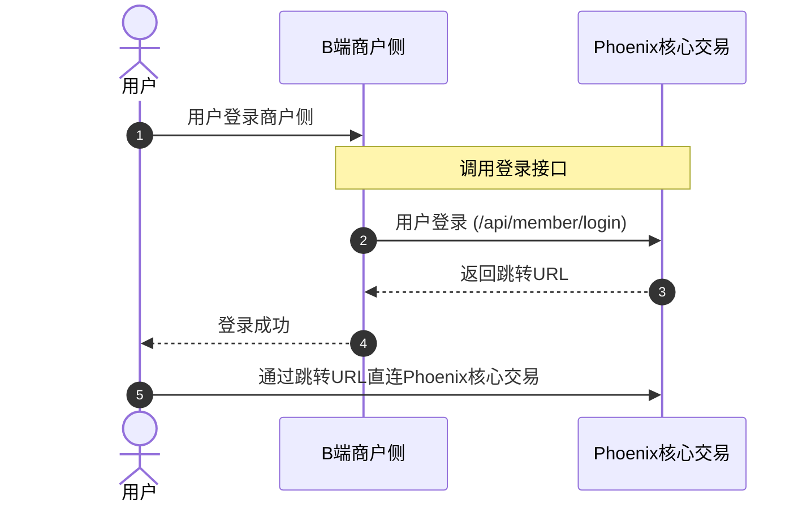

欢迎使用 Phoenix 接口文档。本文档专门为券商（Broker）提供与 Phoenix 交易系统对接的完整技术支持。

通过本文档，您可以实现：
1. **用户同步**: 将您的用户系统映射到Phoenix核心交易。
2. **资产划转**: 实现券商账户与交易平台之间的实时资金划拨。
3. **API Key**: 为您的终端用户生成和管理交易所需的访问密钥。

## 用户接入流程

以下是用户通过商户侧接入 Phoenix 核心交易的流程图：

## API 网关地址

根据您的对接阶段，请选择对应的网关地址进行调用。

| 环境 | 网关地址 |
| :--- | :--- |
| **生产环境** | `https://api.phoenix.io` |
| **测试环境** | `https://api-test.phoenix.io` |

## 快速导航

- [🚀 接入指南](/guide/introduction) - 了解如何开始对接
- [🔑 鉴权说明](/guide/authentication) - 掌握 HMAC 签名计算规则
- [📦 API Reference](/api-reference/user/register) - 查看完整的 OpenAPI 接口定义

## 系统概览

Phoenix Broker 是 Phoenix 系统中连接外部券商与内部撮合引擎的核心组件。通过本接口，您可以实现：

1. **用户同步**: 将您的用户系统映射到 Phoenix 交易 UID。
2. **资产划转**: 实现券商账户与交易平台之间的实时资金划拨。
3. **API Key 管理**: 为您的终端用户生成和管理交易所需的访问密钥。
